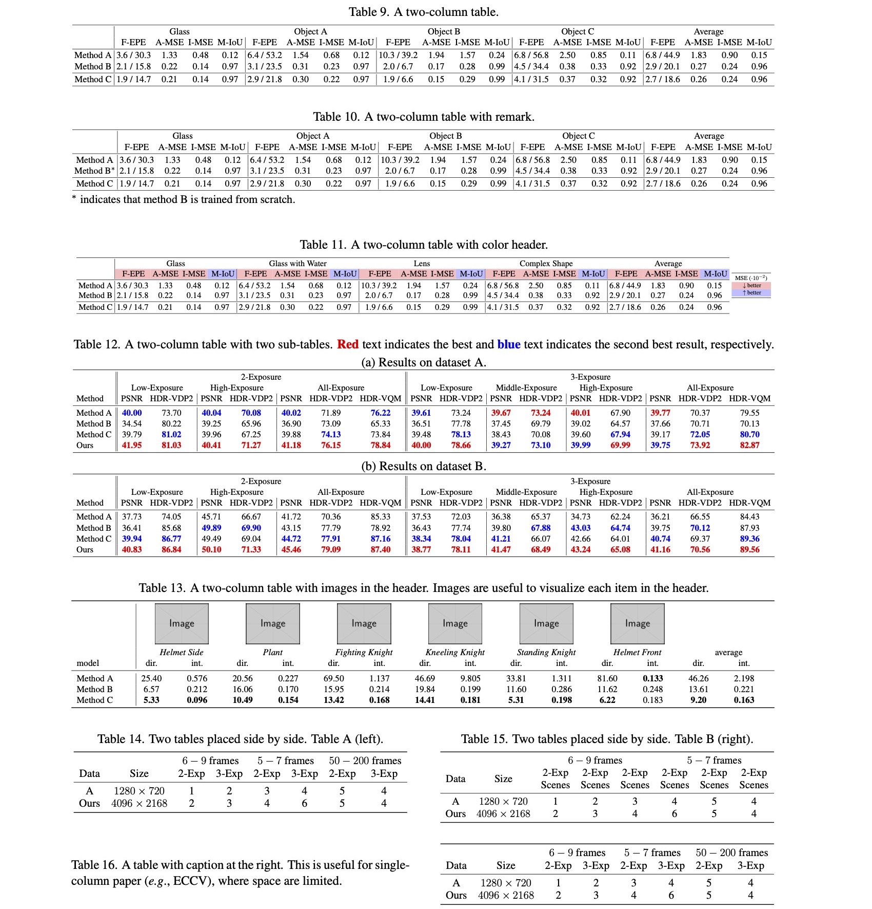
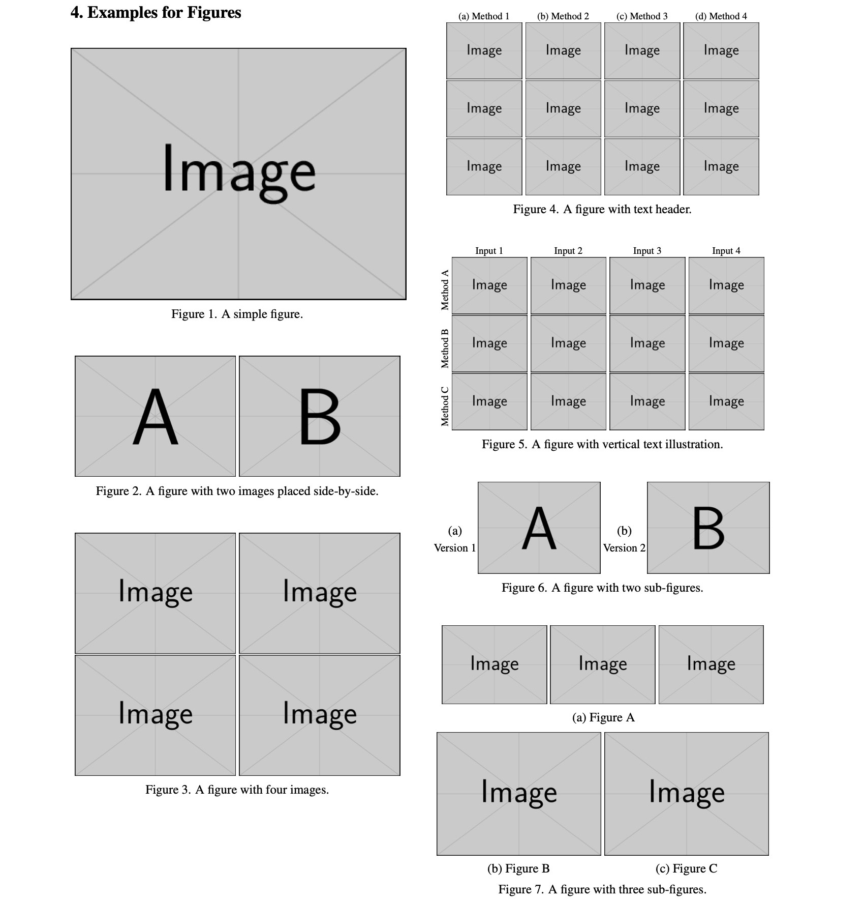
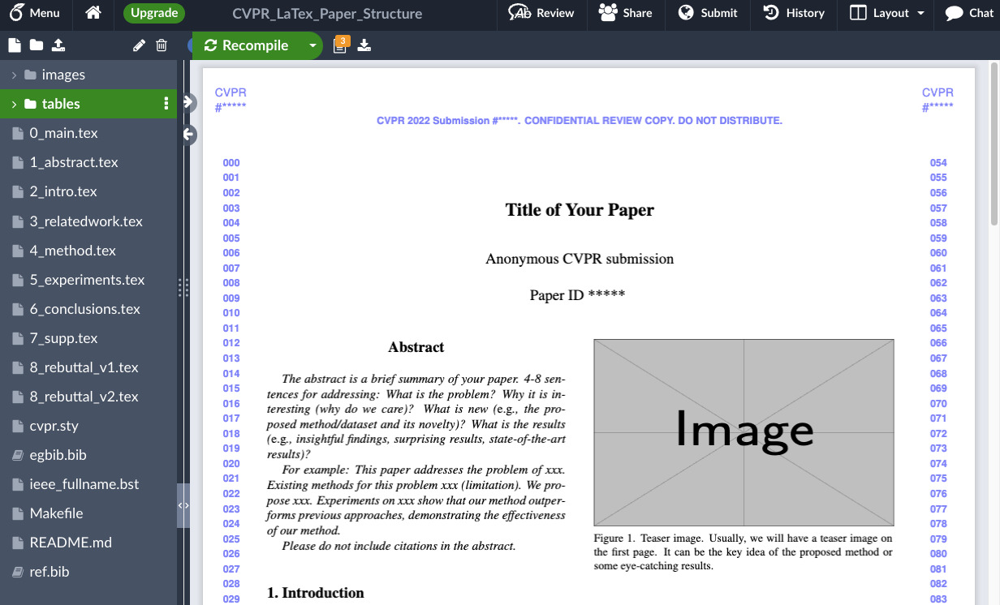
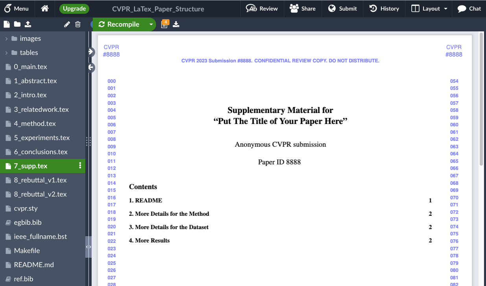
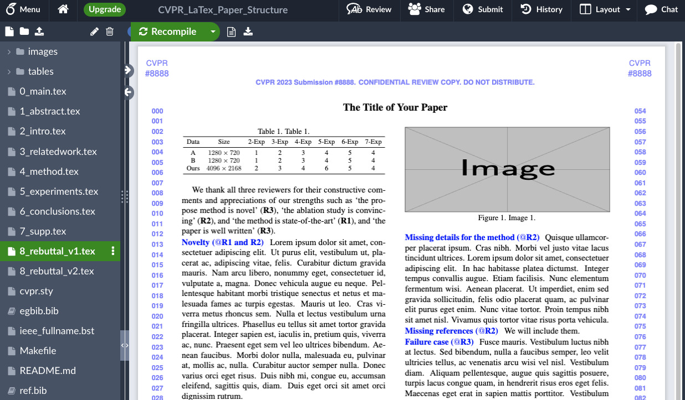
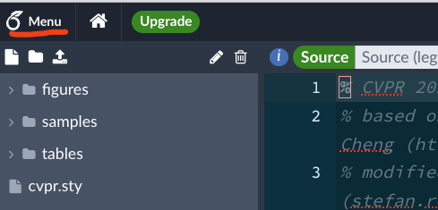
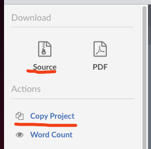

# Tips for Writing a Research Paper using LaTeX

LaTeX is a very powerful tool for documentation preparation, and is often used by researchers to prepare a manuscript for reviewing and publication. 
However, some new graduate students might not have experience in using LaTeX and thus have a difficult time in prepare their first papers.

In this [article (PDF)](./paper_writing_tips.pdf), we will first provide some tips for paper writing.
Then, we will showcase several working examples for the tables and figures, which have been used in our previous publications. The readers are encouraged to adapt those tables and figures to their purposes to save time when preparing their first papers.

**Overleaf Link: https://www.overleaf.com/read/hypvpvnzjjwx**
## Examples for the Tables

    

## Examples for the Figures

    

## More Resources

### Useful LaTeX Template for Paper Submission
- [:boom: Main Paper + Rebuttal + Supplementary for Conference Submission (CVPR/ICCV) in Overleaf](https://www.overleaf.com/read/nzxkcksvjhkr)

    
    
    

**Download or fork the overleaf project: click the menu at the top left, and select `Source` or `Copy`**

    
    

- [Rebuttal for Conference Submission (CVPR/ICCV)](https://github.com/guanyingc/cv_rebuttal_template)
- [Supplementary Material for Conference Submission (CVPR/ICCV/ECCV)](https://www.overleaf.com/read/drpfhrnwyvfz)

### Sample LaTeX Posters for CV Conference Papers
- [TOM-Net: Learning Transparent Object Matting from a Single Image (CVPR 2018)](https://github.com/guanyingc/TOM-Net_Poster_LaTex)
- [PS-FCN: A Flexible Learning Framework for Photometric Stereo (ECCV 2018)](https://github.com/guanyingc/PS-FCN_Poster_LaTex)
- [Self-calibrating Deep Photometric Stereo Networks (CVPR 2019)](https://github.com/guanyingc/SDPS-Net_Poster_LaTex)
- [HDR Video Reconstruction: A Coarse-to-fine Network and A Real-world Benchmark Dataset (ICCV 2021)](https://github.com/guanyingc/DeepHDRVideo_Poster_LaTex)

    

### LaTeX Files for My Thesis
- [Single View Analysis of Non-Lambertian Objects Based on Deep Learning](https://github.com/guanyingc/HKU-PhD-Thesis-LaTex) (PhD Thesis, HKU CS)
- [LaTex Template Files for Undergraduate Thesis (Sun Yat-sen University)](https://github.com/guanyingc/SYSU-LaTex-Thesis)

### Tools for Figure Creation
- [A simple code for plotting figure, colorbar, and cropping with python](https://github.com/guanyingc/python_plot_utils)

### Great Resources Shared by Others
- Paper Writing Tips by MLNLP-World: https://github.com/MLNLP-World/Paper-Writing-Tips
- Paper Picture Writing Code by MLNLP-World: https://github.com/MLNLP-World/Paper-Picture-Writing-Code
